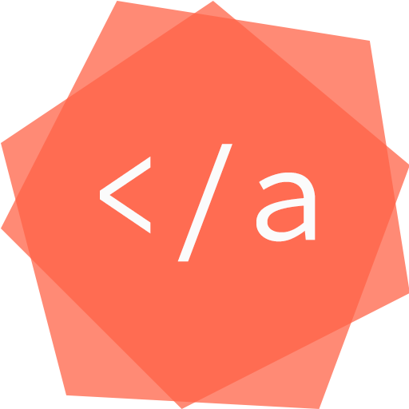

<!-- PROJECT SHIELDS -->
<!--
*** I'm using markdown "reference style" links for readability.
*** Reference links are enclosed in brackets [ ] instead of parentheses ( ).
*** See the bottom of this document for the declaration of the reference variables
*** for contributors-url, forks-url, etc. This is an optional, concise syntax you may use.
*** https://www.markdownguide.org/basic-syntax/#reference-style-links
-->

<!-- PROJECT LOGO -->
 

  

  

    My personal website using Hugo, a static website generator
     
     
    <a href="https://alannguyen.dev/">View Demo</a>
  

<!-- TABLE OF CONTENTS -->
## Table of Contents

* [About the Project](#about-the-project)
* [Contact](#contact)

<!-- ABOUT THE PROJECT -->
## About The Project

[![Product Name Screen Shot][product-screenshot]](https://alannguyen.dev/)
 I used the following Hugo themes:
 - [Hugrid](https://github.com/aerohub/hugrid)
 - [Lodi Theme](https://github.com/xaviablaza/hugo-lodi-theme)

It is also mobile-friendly. I can seamlessly push changes onto this repository's master branch and Netlify automatically deploys for me.

<!-- CONTACT -->
## Contact

Alan Nguyen - anguyen120@pm.me

Project Link: [https://github.com/anguyen120/alannguyen.dev](https://github.com/anguyen120/alannguyen.dev)

<!-- MARKDOWN LINKS & IMAGES -->
<!-- https://www.markdownguide.org/basic-syntax/#reference-style-links -->
[product-screenshot]: static/img/product.png

